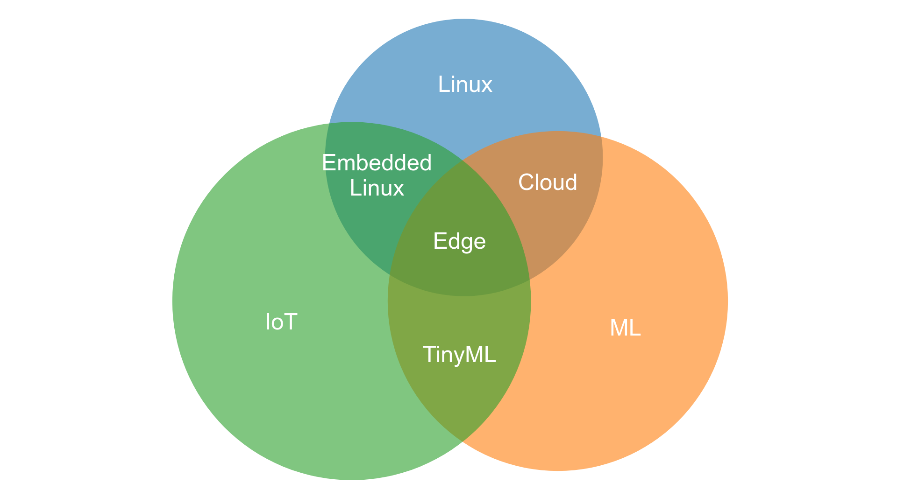

-   [TinyML as-a-Serviceとは？ IoT
    Edgeに対してどのような意味を持つのか？](#tinyml-as-a-serviceとは-iot-edgeに対してどのような意味を持つのか)
-   [Machine learning and IoT
    (機械学習とIoT)](#machine-learning-and-iot-機械学習とiot)
-   [What is TinyML as-a-Service? (TinyML
    as-a-Serviceとは？)](#what-is-tinyml-as-a-service-tinyml-as-a-serviceとは)
-   [The challenges of TinyML as-a-Service (TinyML
    as-a-Serviceの課題)](#the-challenges-of-tinyml-as-a-service-tinyml-as-a-serviceの課題)

<https://www.ericsson.com/en/blog/2019/12/tinyml-as-a-service-iot-edge>
(1/3)

TinyML as-a-Serviceとは？ IoT Edgeに対してどのような意味を持つのか？
====================================================================

TinyML as-a-Service: What is it and what does it mean for the IoT Edge?

> The power of machine learning can have a remarkable technological
> impact at the core of constrained and embedded IoT. Yet various
> technological barriers have so far made it challenging to realize the
> full value of ML-driven IoT at the edge. Could tiny machine learning
> provide a solution? In this Ericsson Research series, we explore the
> possibilities and challenges of machine learning for IoT and introduce
> the concept of TinyML as-a-service. Read on.

機械学習(ML)は組み込みIoT分野において、
技術的に大きな影響を及ぼす可能性があります。 いま現在、IoT
EdgeにおいてMLの価値を完全に実現するには
様々な技術的課題が立ちはだかっています。
TinyMLはそれらの課題を解決することができるでしょうか？ このEricsson
Researchの連載で、 IoTにおける機械学習の可能性と課題を探り、
そして我々のTinyML as-a-Serviceのコンセプトを紹介したいと思います。

> Machine Learning (ML) has profoundly revolutionized and enhanced the
> last decade of computer technologies. By extension, it has impacted
> several application domains and industries ranging across medical,
> automotive, smart cities, smart factories, business, finance, and
> more. Remarkable research efforts are still ongoing today, across both
> industry and academia, to bring the full advantage of the ever-growing
> number of ML algorithms. Here, the aim is to make computing machines,
> of every size factor, smarter and able to deliver sophisticated and
> reliable services.

機械学習(ML)は過去10年間にコンピュータ技術をかなり変革しました。
更に医療、自動車、スマート・シティ、スマート・ファクトリ、エンタープライズ、
金融などを含む派生分野や産業にまで影響を及ぼしました。今日においても、
産業界と学会の両面にわたり、これまでにわたり追加されてきた多大な機械学
習アルゴリズムを利用するため、著しい研究の努力は依然として続けられてい
ます。それらの目的は、すべての形態の計算機械をよりスマートにし、洗練さ
れかつ信頼性のあるサービスを提供できるようにすることです。

Machine learning and IoT (機械学習とIoT)
========================================

> ML applied in the context of the Internet of Things (IoT) is without
> doubt an application domain that has attracted a large amount of
> interest from across the enterprise, industrial and research
> communities. Today, researchers are working extensively to advance
> existing ML-driven IoT in order to boost the quality of experience for
> users of smart devices and improvement of industrial processes.

機械学習をInternet of Things (IoT) のコンテキストに適用するということ
は、間違いなくエンタープライズ、産業界および学会において多大な興味を引
き起こす分野です。今日、研究者はスマート・デバイスのユーザ・エクスペリ
エンスと産業プロセスの改善のために既存のIoT機械学習を進展させようと励
んでいます。

> However, it is worth highlighting how there is not a formal and
> uniform view on what de facto ML in IoT means, and this has led to
> multiple opportunities and interpretations. In our view, taking
> advantage of intelligent algorithms in the IoT context translates to
> also having the possibility to equip IoT end-devices (such as sensors,
> actuators and micro-controllers) with functionalities capable of
> unleashing the power of ML algorithms on the IoT device itself. This
> thus extends the use of ML in IoT beyond in the cloud and more capable
> devices running e.g. Linux.

しかしながら、ここで注意してほしいのは、
"何がデ・ファクトのIoT機械学習か"に対しての公式なかつ統一された見解は
存在しません。そして、これに関して様々は解釈が存在しています。
我々の見解では、
IoTにおけるインテリジェントなアルゴリズム利用とは、IoTエンドデバイス
(センサーやアクチュエータといったマイクロコントーラ)での利用も意味しま
す。それは、まさにIoTデバイス上で機械学習アルゴリズムのパワーを解き放ちます。
これがクラウドやLinuxが動作する高機能デバイスという従来の範疇を超えて、
IoT機械学習を実現するということです。

> In most cases, many consider ML in IoT as having the possibility to
> provide ML inference capabilities to devices similar to the well-known
> Single-Board Computer "Raspberry Pi", with the latter taking the role
> of IoT device. The question is then, how can we put ML algorithms on
> constrained devices that are 32-bit MCUs and not capable of running an
> OS like Linux.

ほとんどの場合、IoT機械学習とは、
有名なシングルボード・コンピュータ"ラズベリーパイ"と同様のデバイス上に
機械学習の推論機能を載せることと思うかもしれませんが、
ここでの問題は、どうすればLinuxが動作しないような組み込み32bitのマイクロ
コントローラ上に機械学習アルゴズムを載せることが可能か？ということになります。

> In order to answer, we first need to come up with a clear idea of what
> can be defined as a constrained IoT device. In the last decades of
> IoT-related research, there have been countless attempts to converge
> towards a common and coherent definition. To our extent, we accept the
> definition and characterization given by the Internet Engineering Task
> Force (IETF) through the RFC 7228bis. We believe that we must consider
> and operate within the world of embedded systems to be able to talk
> about IoT devices at the very deep edge. Embedded can be considered a
> synonym of hardware and software constraints. This, in turn, can be
> considered an antonym of Cloud and Edge – different entities that, in
> this game, can feature big and somehow "unlimited" resources. Embedded
> can also be viewed as embedding the computing, sensing and actuation
> in everyday objects and environments, like a soil sensor in
> agriculture or an appliance in a building.

これに対して回答するために、まずはじめに"組み込みIoTデバイス
"(constrained IoT device)の定義を明確にする必要があります。過去10年間
のIoT関連の研究でこの共通認識を形成するためのに数え切れないほどの試み
がなされました。我々はIETF RFC7228bisでの定義を取り入れます。我々は組
み込みの世界のIoTのもっとも末端にあるデバイスを考慮する必要があると考
えます。"組み込み"とはハードウェアとソフトウェアの制約と同義と考えるこ
とができます。かわって、これはクラウドやエッジと対称なものと考えれます。
クラウドやエッジは強大で無尽蔵なリソースを持ちえます。"組み込み
"(Embedded)とは、計算装置、センサー、アクチュエータを日常的なデバイス
や環境に"組み込む"ということです。例えば、土壌センサやビルの備え付け装
置などといったもののことです。

What is TinyML as-a-Service? (TinyML as-a-Serviceとは？)
========================================================

> Using this explicit definition of a constrained IoT device as a
> starting point, it is thus crucial to characterize the distinction
> between "serving" machine learning to IoT devices, and "developing"
> machine learning within IoT devices.

まずこの"組み込みIoTデバイス"(constrained IoT
device)の明確な定義を採用することで、
機械学習をIoTデバイスのために"提供"(serving)することと、 (誤)
機械学習をIoTデバイス上で"開発"(developing)することを分けて考えることが必要です。
(正)
機械学習をIoTデバイス上で"実行"(processing)することを分けて考えることが必要です。

> In the first case, all the ML-related tasks are “outsourced” to the
> Edge and Cloud, meaning that an IoT device is somehow "passively"
> waiting to receive the rendered ML model algorithm elaboration. In the
> second case, conversely, an IoT device concretely takes part in the
> execution of intelligent services. This is defined as TinyML
> as-a-Service, regardless of the more limited resources compared to
> cloud and edge.

最初のケースでは、すべての機械学習関連のタスクはエッジやクラウドへアウ
トソースされます。つまりIoTデバイスはMLアルゴリズムの出力を待つという
意味で受け身なのです。逆に第２のケースでは、IoTデバイスは実際にインテ
リジェント・サービスに参加します。これがTinyML as-a-Serviceの定義です。
クラウドやエッジと比較して非力なリソースであるということは関係ありません。

> Figure 1 below illustrates the overlap of the different technology
> areas and enablers, as well as providing a clear overview of our
> research focus. From a technological point of view, we can notice how
> there are several overlapping areas which represent the common ground
> between technological areas and technological enablers. As an example,
> the world of embedded Linux can be considered a rally point between
> "Linux" technologies and "Constrained IoT", thus also acknowledging
> that IoT capabilities stretches across the device-edge-cloud realms.
> "TinyML" represents the connecting point between "IoT devices" and
> "ML". It is worth highlighting how TinyML, however it aims to bring ML
> into the embedded world, does not exclusively overlap with
> technological enablers such as Linux. This feature represents a
> crucial aspect of our research area and will be extensively clarified
> in the upcoming articles.

以下の図1はそれぞれ違った技術分野と構成要素の重なりを示しています。
そして我々の研究の焦点も示しています。
技術的観点から、いくつかの重なった領域がある共通認識を提示していることがわかります。
例えば、"Linux"と"IoT"の重なりが"組み込みLinux"です。
IoTはデバイス-エッジ-クラウドにまたがっています。
"TinyML"は"IoT"と"ML"の重なりです。
さらにTinyMLはLinuxを含まずに機械学習を組み込みの世界へ導入することを意味します。
これは我々の研究分野の重要な側面を表しています。
今後の続編でさらに明らかしていきます。

The challenges of TinyML as-a-Service (TinyML as-a-Serviceの課題)
=================================================================

> The difference between "serving" and "developing" ML in IoT devices
> presents some significant technical challenges. Lately, efforts to
> focus on the “developing” technologies have been steadily growing in
> R&D, not only at Ericsson but also across other key technology
> players. The aim is to make it easier and straightforward.

(誤)
IoTデバイスに対する機械学習の"提供"(serving)と"開発"(developing)の差は大きな技術的課題として現れます。
(正)
IoTデバイスに対する機械学習の"提供"(serving)と"実行"(processing)の差は大きな技術的課題として現れます。
(誤)
IoTデバイスに対する機械学習の"開発"(developing)の労力は研究開発において増大してきています。
(正)
IoTデバイスに対する機械学習の"実行"(processing)の労力は研究開発において増大してきています。
これはEricssonに限った話ではなく、業界の他の主要なテクノロジー企業においても同様です。
(誤)
目的は機械学習の"開発"(developing)を容易かつシンプルにすることです。
(正)
目的は機械学習の"実行"(processing)を容易かつシンプルにすることです。

> To this extent, there are three key challenges which we explore:

これに関して、以下の３課題を吟味します。

> 1.  the technical challenges within edge computing and how it cannot
>     be applied to solve all problems
> 2.  the relevance of technological differences between web-based and
>     embedded worlds, especially from deployment and execution
>     perspectives
> 3.  the demand which ML places on computational resources for
>     delivering an accurate and reliable experience

1.  エッジ・コンピューティングの技術的課題、エッジ・コンピューティングが万能でない理由
2.  Webと組み込みの技術的差異、特にデプロイと実行の観点から
3.  機械学習に必要な計算リソース、高精度かつ高信頼性を提供するために

> In this blog series, we introduce and explain how our TinyML
> as-a-Service approach can bridge the worlds of constrained IoT and ML
> together. In doing so, we share the core of the TinyML as-a-Service
> approach, detail the reasons why it is not so straightforward to
> execute plain ML tasks within embedded IoT, and present possible
> additional approaches that, along with TinyML as-a-service, could
> allow to quickly reach a fully ML-driven IoT world.

このシリーズで我々は TinyML
as-a-Serviceがどのように"組み込みIoT"と機械学習をつなげることが
できるか紹介し説明します。TinyML as-a-Serviceのポイントを紹介し、なぜ
機械学習を組み込みIoTに持ち込むのが容易でないのかを詳解します。そして
TinyML as-a-Serviceとともに"組み込みIoT機械学習"を可能する方法を示しま
す。

> Stay tuned in the upcoming weeks to discover more about the
> fascinating fusion between machine learning and IoT at the edge!

機械学習とエッジIoTの魅惑的な融合を発見するために楽しみにお待ちください。
