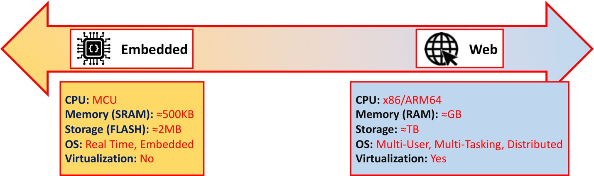
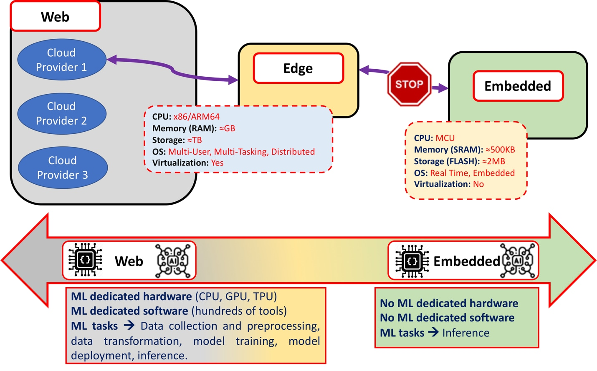

-   [TinyML as-a-Service,
    エッジ機械学習の課題](#tinyml-as-a-service-エッジ機械学習の課題)
-   [なぜエッジ・コンピューティングは万能ではないか？](#なぜエッジコンピューティングは万能ではないか)
-   [Webと組み込みの技術的差異](#webと組み込みの技術的差異)
-   [MLエコシステムは大きくてリソースが必要です。どのようなMLタスクがIoTで実行可能でしょうか？](#mlエコシステムは大きくてリソースが必要ですどのようなmlタスクがiotで実行可能でしょうか)

<https://www.ericsson.com/en/blog/2019/12/tinyml-as-a-service> (2/3)

TinyML as-a-Service, エッジ機械学習の課題
=========================================

TinyML as a Service and the challenges of machine learning at the edge

> The TinyML as-a-Service project at Ericsson Research sets out to
> address the challenges that today limit the potential of machine
> learning (ML) paradigms at the edge of the embedded IoT world. In this
> post, the second post in our TinyML series, we take a closer look at
> the technical and non-technical challenges on our journey to making
> that happen. Learn more below.

まずはじめに Ericsson ResearchにおけるTinyML as-a-Serviceプロジェクトは
現在、組み込みIoTエッジにおける機械学習(ML)の可能性を制限する
課題について述べます。 このTinyMLシリーズの第二回において、
技術的および非技術的な課題の詳細をみていきます。 でははじめましょう。

> This is the second post in a series about tiny machine learning
> (TinyML) at the deep IoT edge. Read our earlier introduction to TinyML
> as-a-Service, to learn how it ranks in respect to traditional
> cloud-based machine learning or the embedded systems domain.

本記事はIoTエッジにおけるTinyMLシリーズの第二回です。
既存のクラウドにおける機械学習や組み込み(Embedded)に対して
TinyMLがどのように位置するものか理解するために 前回のTinyML
as-a-Serviceのイントロダクションの記事を参照してください。

> TinyML is an emerging concept (and community) to run ML inference on
> Ultra Low-Power (ULP \~1mW) microcontrollers. TinyML as a Service will
> democratize TinyML, allowing manufacturers to start their AI business
> with TinyML running on microcontrollers.

TinyMLは超低消費電力マイクロコントローラ上でML推論を行うという、新しく
出始めたコンセプトであり、またそのコニュニティを意味することもあります。
TinyMLaaSはベンダーがマイクロコントローラ上でTinyMLを走らせることでAI
ビジネスを始めるの助けます。

> In this article, we introduce the challenges behind the applicability
> of ML concepts within the IoT embedded world. Furthermore, we
> emphasize how these challenges are not simply due to the constraints
> added by the limited capabilities of embedded devices but are also
> evident where the computation capabilities of ML-based IoT deployments
> are empowered by additional resources confined at the network edge.

本記事では機械学習を組み込みIoTに適用する際の課題を紹介します。
更にこれらの課題は
組み込みデバイス自体のの限られた機能からの制約だけではなく IoT ML
デプロイがネットワーク・エッジのリソースに制限されることも含みます。

> To summarize the nature of these challenges, we can say:
>
> 1.  Edge cannot solve everything
> 2.  Web and embedded components belong, for characteristics, to
>     different technological domains
> 3.  The machine learning ecosystem is big and resource demanding. What
>     ML tasks can be executed in the IoT space?

以上の課題をまとめると、

1.  エッジ・コンピューティングは万能ではない。
2.  Webと組み込みシステムの構成要素の違い。
3.  機械学習エコシステムは多大でリソースを多く使います。
    組み込みIoTで実行可能な機械学習とは？

> Below, we take a closer look at each of these challenges.

以下にそれぞれの課題を詳細にみていきます。

なぜエッジ・コンピューティングは万能ではないか？
================================================

Why edge computing cannot solve everything

> Edge computing promises higher performing service provisioning, both
> from a computational and a connectivity point of view.

エッジ・コンピューティングは 計算能力およびネットワーク接続の観点から
高性能なサービスを展開することを保証します。

> Edge nodes support the latency requirements of mission critical
> communications thanks to their proximity to the end-devices, and
> enhanced hardware and software capabilities allow execution of
> increasingly complex and resource-demanding services in the edge
> nodes. There is growing attention, investments and R&D to make
> execution of ML tasks at the network edge easier. In fact, there are
> already several ML-dedicated "edge" hardware examples (e.g. Edge TPU
> by Google, Jetson Nano by Nvidia, Movidius by Intel) which confirm
> this.

エッジ・ノード群はエンド・デバイスに近いということで
ミッション・クリティカルなレイテンシー条件を満たします。
エッジ・ノード群のもつ増強されたハードウェアとソフトウェアは
エッジ・ノード上のより複雑化し多くのリソースを必要とするサービスの実行
も可能にします。

> Therefore, the question we are asking is: what are the issues that the
> edge computing paradigm has not been able to completely solve yet? And
> how can these issues undermine the applicability of ML concepts in IoT
> and edge computing scenarios?

というわけで、ここでのポイントは、
エッジ・コンピューティングのパラダイムがまだ解決しきれていない問題とは
何か、そしてどのようにその問題が機械学習をIoTやエッジへの適用を妨げるか、
ということになります。

> We intend to focus on and analyze five areas in particular: (Note:
> Some areas we describe below may have solutions through other emerging
> types of edge computing but are not yet commonly available).

５つの分野に注目してみていきたいと思います。 (注:
いくつかの分野は先進的なエッジ・コンピューティングが解決しつつあ
るかもしれませんが、まだ一般的に普及していません)

> Privacy. Data security and user privacy have received much attention
> in recent years, emphasized further by the recurrent news on public
> data leaks. Governments have acted to resolve such privacy issues, for
> example through new regulation and by strengthening already existing
> data security and privacy laws . An obvious example, of this is the
> General Data Protection Regulation (GDPR) enforced by the European
> Union in 2018. Despite these more stringent regulatory actions, many
> data owners still remain cautious, often showing reluctance to trust
> third-party cloud and edge service providers to store and manage their
> data. In simple words, we can affirm that there is a growing
> willingness from the final users for defining physical "on-premises"
> boundaries in which to keep their produced data. This aspect relates
> highly to ML, where data represents the key factor of the entire
> ecosystem. In the wider industry, several approaches have been defined
> such as "federated learning" to overcome such challenges. Here at
> Ericsson, we’re also well aware of the importance of security and
> privacy and remain proactive in addressing wider concerns. TinyML
> as-a-Service goes towards a similar direction of keeping the data
> on-premises, by trying to confine the processing of sensitive data
> only at the IoT device itself (and by consequence avoiding the data
> flowing towards external services).

"プライバシー" データ・セキュリテイとユーザ・プライバシは
頻発する公的データ漏洩ニュースによりさらに
近年、多大な注目を集めています。 政府は
例えば新しい規制や、既存のセキュリティとプライバシ法律の強化を通して
そういったプライバシー問題の解決に乗り出しました。
わかりやすい例は、EUで2018年に施行されたGDPRです。
これらのより厳しい規制に関わらず
多くのデータ保持者は警戒心を強めています。
たびたび第三者であるクラウド、エッジ・サービス・プロバイダが
自分たちのデータを蓄積し管理することに 不本意であることを示しています。
簡単に言えば、 自分たちの生成するデータを保持するために
物理的オンプレミス境界を設定するエンドユーザからの増加する要求
からわかります。
これはデータが全エコシステムの重要要素である機械学習に大変関係しています。
幅広い業種において、 この問題を解決するための "federated
learning"といった、いくつかの手法が定義されました。
Ericssonはセキュリティとプライバシの重要性を理解し、
幅広い関連事項に活動しています。 TinyMLaaSも
機密情報処理をIoTデバイス上に制限することで
データをオンプレミスに保持することで 同様の方針を取っています。

> Network bandwidth. In scenarios characterized by the presence of a
> dense quantity of various IoT end-devices (devices suitable for the
> execution of a wide variety of heterogeneous tasks), it is reasonable
> to assume that the quantity of raw data generated by these devices is
> significant. On the other hand, it is also reasonable to assume that a
> large portion of these devices is equipped with narrowband network
> interfaces (for example NB-IoT or Cat-M1). These limited transmission
> capabilities indicate the need to pre-process the data "on-premises",
> in order to reduce the amount of data to offload at the edge, as well
> as avoid network bottlenecks between end-devices and edge with
> consequent performance degradation.

"ネットワーク帯域"
高密度かつ大量のIoTエンドデバイス(様々な異種のタスク実行用のデバイス)が存在する状況において
当然、これらのデバイスが生成する生データは非常に大量です。
一方、これらのデバイスの大多数は低帯域インターフェース(例えば、NB-IoTかCat-M1)を備えていると思われます。
この限られた転送性能のため、オンプレミスにてデータを前処理する必要があると言えます。
なぜならエッジへオフロードするデータ量の削減するため、
また同様に結果としてネットワーク性能の低減を伴う
エンドデバイスとエッジ間のネットワークのボトルネックを避けるためでもあります。

> Latency. The ability to ensure bounded latency communications to
> deliver high-performance services is a major design requirement for
> emerging mobile networks. This blog has already hosted several
> articles for explaining how 5G is the major enabler for
> latency-critical IoT applications and ensuring ultra-reliable and
> low-latency communications. We have also emphasized how the edge
> network plays a key role for supporting massive and critical machine
> type communication use cases, by ensuring millisecond-latency. TinyML
> as-a-service aims to further reduce network latency, by moving the
> execution of certain ML tasks (e.g. inference) to the device itself.
> Although this sort of “near-zero” latency is desirable and made
> possible through our approach, it is worth clarifying that we still
> cannot prescind from the support of the network edge and the rest of
> the mobile network.

"ネットワーク遅延" 高性能サービスを届けるための
限界遅延コニュニケーションを保証する能力は
新しいモバイルネットワークの重要なデザイン要件です。
このサイトではすでに
５Gがどのように重要な低遅延IoTアプリケーションに必要か
超高信頼低遅延コニュニケーションを保証するか
といったいくつかの記事を掲載しています。 さらに
大量で重要なマシン・タイプ・コミュニケーションのユースケースで
ミリセカンドの遅延を保証しながら
エッジネットワークが重要な役割を果していることを強調しておきます。
TinyMLaaSの狙いはさらなる遅延短縮のために
MLタスク(推論)実行をデバイス自身へ持っていくことです。
ほぼゼロ遅延が望ましく、我々のアプローチで可能ですが
ネットワーク・エッジのサポートや残りのモバイル・ネットワークから
切り離すことはできないということは重要です。

> Reliability. In scenarios where cellular coverage cannot always be
> ensured such as in the case of limited or no connectivity in rural
> areas or on the open sea, neither the cloud nor the edge can extend
> the computation and connectivity capabilities of the end-devices.
> Consequently, the ability to perform “not dummy” tasks on-premises
> becomes a desirable and necessary feature. Being able to execute
> certain ML operations locally that were previously executed at the
> edge or in the cloud, as TinyML as-a-Service aims to do, inevitably
> produces several advantages.

"信頼性"
地方や海上で制限された、もしくはまったくコネクティビティないような
セルラーの受信がが保証されないシナリオにおいて
クラウドやエッジはエンドデバイスの計算能力や接続能力を拡張することができません。
その結果、 TinyMLaasが処理しようとする
以前はエッジかクラウドで実行されてたような
あるML処理をその場で実行できることは間違いなく有利です。

> Energy efficiency. It is a well-known fact that one main design
> requirement of IoT networks is energy efficiency, especially
> considering the high probability that IoT devices are battery powered.
> There is however a further energy efficiency aspect that is often
> ignored, but which in reality can become extremely relevant. This
> relates to the fact that, in certain cases, network transmission can
> consume more energy than local computing. Considering this last
> element and the battery powered design of most IoT devices, TinyML
> as-a-Service has been designed to enable local processing in the IoT
> device itself, along with data transmission and ML computation in the
> edge and cloud.

"エネルギー効率" よく知られているように
特に高確率でIoTデバイスがバッテリー駆動であるとこと考えれば、
IoTネットワークの一つの設計要件はエネルギー効率です。 しかしながら
無視されがちだが
実際には非常に影響を及ぼすさらなるエネルギー効率の特徴があります。
これは次の事実に関連しています。 あるケースでは
ネットワーク転送はローカルでの計算処理よりもエネルギーを消費する
ということです。
この要素とほとんどのIoTデバイスがバッテリー駆動であることを考えて
エッジとクラウドにおけるデータ転送、ML処理とともに TinyMLaaSは
IoTデバイス上のローカルでの計算処理を可能にするように設計されています。

Webと組み込みの技術的差異
=========================

Technological differences between web and embedded

> The web and the embedded worlds feature very heterogeneous
> characteristics. Figure 1 (above) depicts how this high heterogeneity
> is characterized, by comparing qualitatively and quantitively the
> capacities of the two paradigms both from a hardware and software
> perspective. Web services can rely on powerful underlying CPU
> architectures with high memory and storage capabilities. From a
> software perspective, web technologies can be designed to choose and
> benefit from a multitude of sophisticated operating systems (OS) and
> complex software tools.

Webと組み込みはまったく違う特徴を持ちます。 上記の図１は
ハードウェア、ソフトウェアの両方の観点から定量的、定性的比較で
この違いを示しています。
Webサービスは強力なCPU、高いメモリーとストレージ容量に基づいています。
ソフトウェアの観点から Webテクノロジーは
豊富な洗練されたOSと複雑なソフトウェア・ツールを選択し恩恵を受けるように
設計することができます。

> On the other hand, embedded systems can rely on the limited capacity
> of microcontroller units (MCUs) and CPUs that are much less powerful
> when compared with general-purpose and consumer CPUs. The same applies
> with memory and storage capabilities, where 500KB of SRAM and a few
> MBs of FLASH memory can already be considered an extensive resource.
> There have been several attempts to bring the flexibility of
> Linux-based systems into the embedded scenario (e.g. Yocto Project),
> but nevertheless most 32bit MCU-based devices have the capacity to run
> real-time operating systems and no more complex distribution.

一方、組み込みシステムは
汎用のコンシューマ向けCPUと比較すると非常に非力なMCUとCPUという制限された機能に
基づいています。 メモリーとストレージにおいても同様です。
500KBのSRAM、1-4MBのフラッシュメモリーは高価なリソースと考えられます。
Linuxベースのシステムを組み込みにという試行は様々なされましたが、
多数の32bit MCUのデバイスはRTOS向けの容量しかもたず、
それよりも複雑なディストリビューションには合いませんでした。

> In simple terms, when Linux can run, system deployment is made easier
> since software portability becomes straightforward. Furthermore, an
> even higher cross-platform software portability is also made possible
> thanks to the wide support and usage of lightweight virtualization
> technologies such as containers. With almost no effort, developers can
> basically ship the same software functionalities between entities
> operating under Linux distributions, as happens in the case of cloud
> and edge.

つまりLinuxが動く限りシステム開発は簡単になります。
理由はソフトウェアの移植が簡単だからです。
Webサポートとコンテナといった軽量仮想化技術を使用することで
更に高度なプラットフォーム非依存なソフトウェアの移植性が可能となります。
Linux環境でありされすば、
開発者は労せず基本的に同じソフトウェア機能をリリースすることができます。
これがクラウドとエッジで起こっていることです。

> The impossibility of running Linux and container-based virtualization
> in MCUs represents one of the most limiting issues and biggest
> challenges for current deployments. In fact, it appears clear how in
> typical "cloud-edge-embedded devices" scenarios, cloud and edge
> services are developed and deployed with hardware and software
> technologies which are fundamentally different and easier to manage
> compared to embedded technologies.

MCU上でLinuxとコンテナ仮想化が使えないとうことが、
現在のデプロイの最大の制限であり最大の課題の一つです。
実際、明白なことに 典型的な"クラウド - エッジ -
組み込み機器"の構成において 組み込み技術と対比して
クラウドとエッジ・サービスは
根本的に違うハードウェアとソフトウェア技術で開発されデプロイされ
容易に管理できます。

> TinyML as-a-Service tries to tackle this issue by taking advantage of
> alternative (and lightweight) software solutions.

TinyMLaaSは
全く異なる(かつ軽量な)ソフトウェア・ソリューションを利用することで
この問題に取り組んでいます。

> The Machine Learning ecosystem is big and resource demanding. What ML
> tasks can be executed in the IoT space?

MLエコシステムは大きくてリソースが必要です。どのようなMLタスクがIoTで実行可能でしょうか？
=========================================================================================

The Machine Learning ecosystem is big and resource demanding

> In the previous section, we considered on a high-level how the
> technological differences between web and embedded domains can
> implicitly and significantly affect the execution of ML tasks on IoT
> devices. Here, we analyze how a big technological gap exists also in
> the availability of ML-dedicated hardware and software web, edge, and
> embedded entities.

前章において Webと組み込みの技術的差異が
IoTデバイス上でのMLタスクの実行にそれとなく多大な影響を及ぼすのを
を概観しました。 ここでどのようにしてWeb、エッジ、組み込みにおいて
ML専用ハードウェア/ソフトウェアの有無という点で
大きな技術的ギャップ存在しているかを解析します。

> From a hardware perspective, during most of computing history there
> have been only a few types of processors, mostly available for general
> use. Recently, the relentless growth of artificial intelligence (AI)
> has led to the optimization of ML tasks for existing chip designs such
> as graphics processing units (GPUs), as well as the design of new
> dedicated hardware forms such as application specific integrated
> circuits (ASICs), which embed chips designed exclusively for the
> execution of specific ML operations. The common thread that connects
> all these new devices is their usage at the edge. In fact, these
> credit-card sized devices are designed with the idea of operating at
> the network edge.

ハードウェアの観点から ほとんどのコンピュータの歴史上、
たった少しの汎用用途のプロセッサしか存在しませんでした。
近年、絶え間なく続くAIの成長は
既存のGPU向けMLタスクの最適化へ続きました。
同様にもっぱら特定のML演算向けに設計されたASICといった
新しい専用ハードウェアの形態へも続きました。
これら全ての新しいデバイスの共通点はエッジで使用されるということです。
事実、これらのクレジットカードサイズのデバイスはエッジで動作するように設計されました。

> At the beginning of this article we mentioned a few examples of this
> new family of devices (Edge TPU, Jetson Nano, Movidius). We foresee
> that in the near future even more big and small chip and hardware
> manufacturers will increasingly invest resources into the design and
> production of ML-dedicated hardware. However, it appears clear how, at
> least so far, there has not been the same effort in the embedded
> world.

この記事の最初で この新しいデバイスの例(Edge TPU, Jetson Nano,
Movidius)を紹介しました。
近いうちにより多くのハードウェア製造業者がML専用ハードウェアの設計製造に投資すると
予見します。
しかしながら現時点で明白なのは、組み込みで同様ではなかったということです。

> Such a lack of hardware availability undermines somehow a homogeneous
> and seamless ML "cloud-to-embedded" deployments. In many scenarios,
> the software can help compensate for hardware deficiencies. However,
> the same boundaries that we find in the hardware sphere apply for the
> development of software tools. Today, in the web domain, there are
> hundreds of ML-oriented application software. Such availability is
> registering a constant growth thanks also to the possibility given by
> the different open source initiatives that allow passionate developers
> all over the world to merge efforts. The result is more effective,
> refined, and niche applications. However, the portability of these
> applications into embedded devices is not so straightforward. The
> usage of high-level programming languages (for instance Python), as
> well as the large sizes of the software runtime (intended as both
> runtime system and runtime program lifecycle phase) are just some of
> the reasons why software portability is painful, if not impossible.

ML専用ハードウェアがないことで
一貫したクラウドから組み込みに向けてのMLデプロイができませんでした。
多くの場合、 ソフトウェアはハードウェアの欠如を補う助けとなります。
しかし ハードウェアで見た限界はソフトウェアツールの開発でも同様です。
今日Webでは たくさんのMLアプリケーション・ソフトウェアがあります。
世界中の熱心な開発者のマージ作業を可能にする様々なオープンソース活動のおかげで
それらの利用は一定に成長しています。
その結果はもっと効果的で洗練され、そしてニッチなアプリケーションです。
しかし、そういったアプリケーションの移植性は簡単ではありません。
大きなランタイムとPythonのような高級言語の利用が理由です。

> The main rationale behind the TinyML as-a-Service approach is
> precisely the one to break the existing wall between cloud/edge and
> embedded entities. However, to expect exactly the same ML experience
> in the embedded domain as we have in the web and enterprise world
> would be unrealistic. It is still an irrefutable fact that size
> matters. The execution of ML inference is the only operation that we
> reasonably foresee to be executed in an IoT device. We are happy to
> leave all the other cumbersome ML tasks, such as data processing and
> training, to the more equipped and resourceful side of the scenario
> depicted in Figure 2.

TinyMLaaSの根拠はクラウド/エッジと組み込みの壁を破るということです。
しかし、Webやエンタープライズと同様のMLエクスペリエンスを期待することは現実的ではありません。
サイズというのは無視できない問題です。
ML推論実行だけはIoTデバイス上で実行可能と予見することができます。
図２に図示されている整備されたリソース豊富なデータの処理とトレーニング
といった他すべての面倒なMLタスクはおいていってもいいでしょう。

> Read more In the next article, we will go through the different
> features which characterize TinyML as-a-Service and share the
> technological approach underlying the TinyML as-a-Service concept.

次回の記事では TinyML as-a-Serviceを特徴づける様々な機能を一覧し、
TinyML as-a-Serviceのコンセプトの下にある 技術的アプローチを紹介します。

> In the meantime, if you have not read it yet, we recommend reading our
> earlier introduction to TinyML as-a-Service.

しばしの間、もしお読みでなければ、
我々の前回の記事をお読みになることをお薦めします。 introduction to
TinyML as-a-Service
<https://www.ericsson.com/en/blog/2019/12/tinyml-as-a-service-iot-edge>

> The IoT world needs a complete ML experience. TinyML as-a-service can
> be one possible solution for making this enhanced experience possible,
> as well as expanding potential technology opportunities. Stay tuned!

IoTには一貫した機械学習のエクスペリエンスが必要です。

TinyMLaaSは 潜在的なテクノロジーの機会を押し広げながら
一貫した機械学習のエクスペリエンスを可能にする
ソリューションとなる可能性があります。 乞うご期待。
