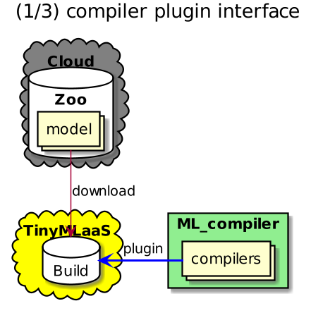
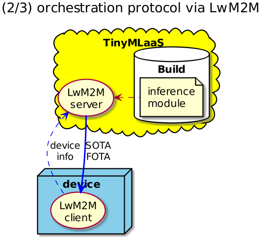
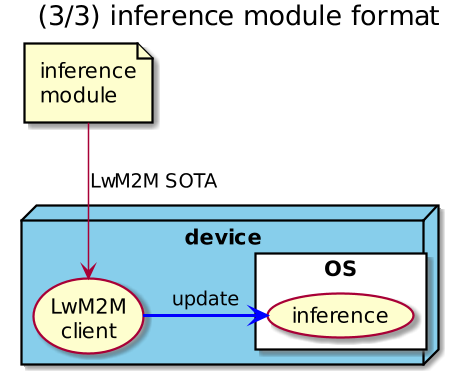
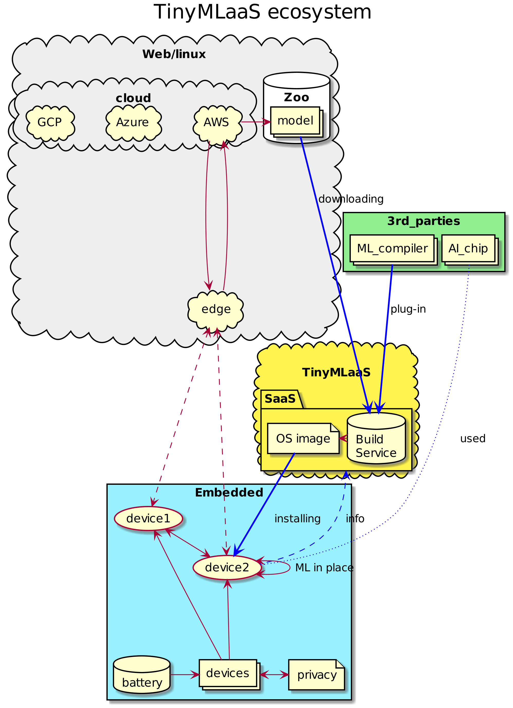

-   [IoTデバイスで機械学習を身近なものにするには？](#iotデバイスで機械学習を身近なものにするには)
-   [TinyMLaaSを可能にするアプローチ](#tinymlaasを可能にするアプローチ)
-   [TiyMLaaSエコシステムの構築](#tiymlaasエコシステムの構築)
-   [From TinyMLaaS to MLCaaS](#from-tinymlaas-to-mlcaas)
-   [結論](#結論)

<https://www.ericsson.com/en/blog/2020/2/how-can-we-democratize-machine-learning-iot-devices>
(3/3)

IoTデバイスで機械学習を身近なものにするには？
=============================================

How can we democratize machine learning on IoT devices?

> Making tiny machine learning widely available on edge IoT devices
> could prove to be a major leap in smart sensing across industries.
> Below, we plot the technical milestones to making that happen as part
> of our ongoing research into TinyML as-a-service.

小さい機械学習をIoTエッジデバイスで広く可能にすれば、
様々なインダストリーを超えてスマート・センシングにおける飛躍となるでしょう。
以下、我々の現在進行中のTinyML as-a-Serviceプロジェクトの一環として
IoT機械学習を可能にする技術的なマイルストーンを示します。

> TinyML, as a concept, concerns the running of ML inference on Ultra
> Low-Power (ULP \~1mW) microcontrollers found on IoT devices. Yet
> today, various challenges still limit the effective execution of
> TinyML in the embedded IoT world. As both a concept and community, it
> is still under development.

概念としてのTinyMLは IoTデバイスの超低消費電力(ULP
\~1mW)のマイクロコントローラ上で 機械学習の推論を実行することです。
今日でさえ、
様々な課題が組み込みIoTでのTinyMLの効率的な実行を制限しています。

> Here at Ericsson, the focus of our TinyML as-a-Service (TinyMLaaS)
> activity is to democratize TinyML, enabling manufacturers to start
> their AI businesses using TinyML, which runs on 8, 16 and 32 bit
> microcontrollers.

我々EricssonのTinyMLaaSの焦点はTinyMLを容易にすることです。
それは製造業者が 8、16、32ビットのマイクロコントローラ上で
TinyMLを使うAIビジネスを容易に始めれるようにすることです。

> Our goal is to make the execution of ML tasks possible and easy in a
> specific class of devices. These devices are characterized by very
> constrained hardware and software resources such as sensor and
> actuator nodes based on these microcontrollers.

我々の目的は ある特定のクラスのデバイスにおいて
機械学習タスクの実行を容易にすることです。 それらのデバイスは
マイクロコントローラ上のセンサーやアクチュエータといった
非常に非力なハードウェアとソフトウェアのリソースのカテゴリーです。

> Below, we present how we can bind the “as-a-service” model to TinyML.
> We will provide a high-level technical overview of our concept and
> introduce the design requirements and building blocks which
> characterize this emerging paradigm.

以下、どのようにしてTinyMLに"as-a-Service"を結びつけたか紹介します。
我々のコンセプトの技術的な概観を示し、
この新しいパラダイムを形成するデザイン要件と構成要素を紹介します。

> This is the third instalment in our series on tiny machine learning
> (TinyML) as-a-service. In our earlier articles, we offer an
> introduction to TinyML as-a-service and explore the challenges of
> machine learning at the edge.

これはTinyML as-a-Service連載の３回目です。 以前の記事では、 "TinyML
as-a-Serviceの紹介"、"エッジでの機械学習の課題"を紹介しました。

TinyMLaaSを可能にするアプローチ
===============================

What is our approach for making TinyMLaaS possible?

> We propose to build a higher-level abstraction of TinyML software that
> is as hardware and software agnostic as possible. Furthermore, we will
> do this in an "as a Service" fashion. Why? The advantages of using
> specialized hardware for ML must be balanced with the use of dedicated
> ML compilers that adapt a certain ML model to the targeted hardware
> platform. This hardware and associated compilers’ heterogeneity (i.e.
> application of various kinds of special hardware) generates additional
> fragmentation. It also offers poor flexibility against the possibility
> of easily switching hardware context due to the need to re-compile the
> ML inference model for the targeted device. ML compilers are very
> powerful tools and we don't want to disregard their important role in
> the ML ecosystem.

ハードウェアとソフトウェアの依存度を可能な限りなくして
TinyMLソフトウェアの高位抽象化を構築することを提案します。
さらにそれを"as-a-Service"として提供します。 なぜか？
機械学習のための特製ハードウェア利用は専用のMLコンパイラを必要とします。
MLコンパイラは機械学習モデルをそのハードウェア用に変換します。
ハードウェアと専用コンパイラという特殊性は様々な分断化を生みます。
また目的のハードウェア用に再コンパイルが必要というのは柔軟性に欠けます。
MLコンパイラは非常に強力なツールなので、
機械学習エコシステムにおけるその重要な役割を無視できません。

> This software abstraction is the foundation of TinyMLaaS - a cloud or
> edge service designed to host a wide set of ML compilers. It is the
> job of these compilers to convert a specific ML inference model into
> the appropriate format for being executed in the served device.

このソフトウェア抽象化がTinyMLaaSの基礎です。
それは幅広いMLコンパイラを提供するように
デザインされたクラウドもしくはエッジサービスです。
デバイス上で実行できるように
特定のML推論モデルを適当なフォーマットに変換するのが
MLコンパイラの仕事です。

> We believe that creating an ecosystem around TinyML, based on our
> TinyMLaaS concept, is a way forward. Such an ecosystem would enable
> developers to seamlessly build and compile ML inference models
> regardless of the underlying hardware platform.

我々のTinyMLコンセプトに基づいたエコシステムが必要だと思います。
このエコシステムで開発者はハードウェア・プラットフォームに関わらず
ML推論モデルをコンパイルすることができます。

> To tailor an ML inference model for running in a specific device,
> TinyMLaaS needs to gather some information about the device itself,
> such as CPU type, RAM and ROM size, available peripherals, underlying
> software, and the correct inference model to process.

ML推論モデルを特定デバイス向けにカスタマイズするために
TinyMLaaSは次のようなデバイス自体の情報を収集する必要があります。
CPUタイプ、RAM/ROMサイズ、利用可能なペリフェラル・デバイス、基本ソフトウェア、実行する推論モデル。

> The TinyMLaaS backend will select the most suitable ML compiler and
> generate the compiled ML inference module on the basis of the above
> parameters. The generated ML inference module is then downloaded and
> installed on the designated device.

上記のパラメータに基づいて TinyMLaaSバックエンドは
最適なMLコンパイラを選択してML推論モジュールを生成します。

> In our work, communication with the end-devices is handled through the
> LightweightM2M (LwM2M) device management protocol. There are multiple
> reasons for choosing LwM2M in the context of IoT and embedded systems.
> To learn why, check out our earlier blog posts from 2017, 2015 and
> 2014.

我々の実装では、
エンド・デバイスとのコミュニケーションにLwM2Mデバイス・マネージメント・プロトコルが使われています。
IoTと組み込みシステムのコンテキストでLwM2Mが選ばれるにはいくつかの理由があります。
この理由を知るためにこれらの以前の記事を参照してください。

> TinyMLaaS relies on LwM2M also to benefit from Firmware-over-the-air
> (FOTA) and Software-over-the-air (SOTA) update capabilities. The
> integration between LwM2M and IPSO Objects is harnessed, with the aim
> of using a standardized model when end-devices and a TinyMLaaS
> instance exchange device characteristics information.

TinyMLaaSはLwM2Mを使うのは
Firmware-Over-The-Air(FOTA)とSoftware-Over-The-Air(SOTA)アップデートを利用するためでもあります。
エンド・デバイスとTinyMLaaSがデバイス情報を交換するときに
標準モデルを利用したいためにLwM2MとIPSOが一緒に統合されています。

TiyMLaaSエコシステムの構築
==========================

Expanding the TinyMLaaS ecosystem

> The approach used in TinyMLaaS can be useful for enhancing ML
> interoperability between different devices from different
> manufacturers, allowing small and medium-sized enterprises (SMEs) to
> easily join the game along with bigger firms. Our idea is to serve as
> many devices as possible and break the existing interoperability
> barrier between different AI chips and related compilers. In order to
> unlock this interoperability, there are three essential components
> which characterize TinyMLaaS: compiler plugin interface, orchestration
> protocol, and inference module format.

TinyMLaaSのアプローチは
様々な製造業者からの様々なデバイス間のML相互運用性を強化するにも
役立ちます。
そのおかげで中小規模事業者は大企業とともにゲームに容易に参加できます。
できるだけ多くのデバイスにサービスを提供して
様々なAIチップとそのコンパイラ間にある既存の相互運用の壁を壊すことです。
この相互運用を可能にするためには、
TinyMLaaSを構成する３つの必要不可欠な構成要素があります：
"コンパイラ・プラグイン"、"オーケストレーション・プロトコル"、"推論モジュール・フォーマット"

*Figure 1: Standardizing three components for the TinyMLaaS ecosystem*

> Supporting these three components represents the basic requirement for
> embedding a hardware platform to the TinyMLaaS ecosystem. By defining
> them, we also offer a foundation for each to work independently and
> then bind them together to enable AI business. In the figures below,
> we depict the purpose of each three components.

この３つの構成要素をサポートすることが
ハードウェア・プラットフォームをTinyMLaaSエコシステムに参加させるために必要です。
この３つの構成要素を定義することで
それぞれの構成用をが独立して実装することができ
あとでAIビジネスのために統合することができます。
以下の図で３つの構成要素の目的を図示しています。

> The first component, the compiler plugin interface (below), is the
> definition of parameters to pass and output format to return from the
> TinyMLaaS backend (ML compiler). TinyMLaaS is a kind of front-end to
> accept requests, and it could have multiple backends of ML compilers.
> A request is sent to an appropriate backend and it returns the output
> of compilation. As we are aiming to host multiple ML compilers from
> different vendors, it would be desirable to define a standard for such
> parameters rather than adapt the parameters to the device in use.

最初の構成要素のコンパイラ・プラグイン・インターフェースは、
TinyMLaaSバックエンド(MLコンパイラ)に渡すパラメータと、
その戻り値の出力フォーマットです。
TinyMLaaSはリクエストを受け付けるフロントエンドようなもので
複数のMLコンパイラのバックエンドを持ちます。
リクエストは適当なバックエンドへと送られ コンパイルの出力が返されます。
様々なベンダーからの複数のMLコンパイラを持つために
使用するデバイスへのパラメータを修正するよりも
標準化されたパラメータを定義することが望ましいです。

> The second component, the orchestration protocol (below), is used to
> first get device capabilities and then install a generated image onto
> a device. This element enables explicit interactions between devices
> and TinyMLaaS on the basis of well-defined APIs. In this respect,
> LwM2M has the appropriate characteristics for taking advantage of a
> standardized protocol, particularly suitable for the embedded IoT
> context.

第２の構成要素のオーケストレーション・プロトコルは、
まずデバイスの機能を収集します。
そして次に生成されたイメージをデバイスにインストールします。
この構成要素のおかげで
デバイスとTinyMLaaSは洗練されたAPIを用いてインタラクションすることができます。
この点において
LwM2Mは標準のプロトコルを用いているので最適の特性を持ちます。
また、特に組み込みIoTに適しています。

> The third component, the inference module format (below), is needed at
> SOTA, which is a partial software update, to support multiple types of
> real time operating systems with a single format. This is basically
> the ML inference application itself as well as the "output" processed
> by the ML compiler. The output format of such an application is
> tailored by the ML compiler according to the underlying software and
> hardware characteristics of the device that is using it. The large
> number of heterogenous devices and the lack of a consistent inference
> format model means that this process remains fragmented. In this
> respect, we look forward for a step toward a process of standardizing
> the inference format model, so as to ensure an easier ML software
> portability between devices.

第２の構成要素の推論モジュール・フォーマットはSOTAで必要となります。
SOTAは部分的ソフトウェア・アップデートです。
これは複数のリアルタイムOSを単一のフォーマットでサポートするためです。
これは基本的にMLコンパイラに処理された出力と同様にML推論アプリケーションそのものです。
大多数の異種デバイスが一貫性のある推論モデルのフォーマットをもたないため
ここでのプロセスは統一されていません。
この点からデバイス間のMLソフトウェアの移植性を容易にするために
推論モジュール・フォーマットを標準化することを待ち望んでいます。

> Mapping the lifecycle process of the TinyMLaaS ecosystem In figure 5
> (below), we depict how these interfaces are employed in a typical
> cloud-edge-device scenario. The blue arrows indicate how those
> components interact in this ecosystem.

TinyMLaaSエコシステムのライフサイクルのプロセスをあてはめると
以下の図５において 典型的なクラウド-エッジ-デバイスのシナリオのなかで
これらのインターフェースが使用されるかを示しています。
青い矢印は構成要素がエコシステム内でどのように働くかを示しています。

From TinyMLaaS to MLCaaS
========================

> The principles used in TinyMLaaS can represent an important element in
> tackling the high heterogeneity which characterizes the ML ecosystem.
> As we explained in the first two articles of this series, there are ML
> frameworks and ML-optimized hardware showing up more frequently,
> targeting different execution environments (e.g. cloud, edge, IoT
> devices).

TinyMLaaSで使用された原理は
MLエコシステムを特徴づける高異種性に挑む重要な要素を示しています。
このシリーズの最初の２記事で解説したように
様々な実行環境(クラウド、エッジ、IoTデバイス)向けに
MLフレームワークやML向けハードウェアはこれからもっと出てくるでしょう。

> The possibility of relying on ML-based IoT systems, composed of
> heterogeneous components interacting between each other, is something
> highly desirable but equally difficult to achieve with the current
> solutions. TinyMLaaS aims to bridge the gap in this respect.

様々な異質の構成要素からなるML-IoTシステムを利用する可能性を非常に待ち望んでいますが
現在のソリューションでは同じくらい達成が難しいものです。
TinyMLaaSの狙いはこのギャップを埋めることです。

> Furthermore, this concept can also be disjoined by the IoT and
> reformulated, similarly and on a higher level, as ML Compiler
> as-a-Service (MLCaaS). In fact, as long as a ML framework generates a
> standardized computational graph (i.e. through ONNX), the ML compiler
> can more easily generate the ML inference model software suitable for
> a targeted hardware.

更にこのコンセプトはIoTから切り離して 同様かつより高い次元で ML
as-a-Service(MLCaaS)として再構成されます。
実際、MLフレームワークが標準の計算グラフを生成する限り
MLコンパイラは容易に
目標のハードウェア向けのML推論モジュールを生成します。

> This basically represents the rationale of our activity. We are
> working for building a service platform that can offer seamless
> migration of a ML application between, for example, cloud computing
> environments with GPU, edge computing with FPGA or IoT devices with
> constrained AI chip.

これは基本的に我々の活動の論理的根拠となります。
我々はGPUを持つクラウド・コンピューティング環境、
FPGAを持つエッジ・コンピューティング、
もしくはAIチップを持つIoTデバイス間における
MLアプリケーションのスムーズな移行を提供できる
サービス・プラットフォームの構築に励んでいます。

結論
====

Summary

> We hope that you enjoyed our series about TinyMLaaS.
>
> The TinyML community has evolved a lot during the last year. Ecosystem
> players, like chip vendors, compiler companies, service providers etc.
> have an opportunity to both influence and accelerate the development
> of the ecosystem. Here at Ericsson, we very much encourage and invite
> this level of cross-industry collaboration.

TinyMLaaSシリーズを楽しんでもらえたら幸いです。
TinyMLコミュニティは去年一年間で大躍進しました。
チップベンダー、コンパイラ業者、サービス提供者などのエコシステム参加者は
このエコシステムの発展に関わり影響を及ぼすことができます。
我々Ericssonは産業の垣根を超えたコラボレーションを促進しかつ待ち望んでいます。

> Hiroshi Doyu is presenting a talk about "TinyML as-a-Service" at
> Linaro Connect, Budapest, Hungary at the end of March. Please drop by
> if you are interested or contact him on LinkedIn.
>
> Learn more Read our earlier blog posts where we offer an introduction
> to TinyML as-a-service and explore the challenges of machine learning
> at the edge.

前回記事

-   "TinyML as-a-Serviceの紹介"
    <https://www.ericsson.com/en/blog/2019/12/tinyml-as-a-service-iot-edge>
-   "エッジでの機械学習の課題"
    <https://www.ericsson.com/en/blog/2019/12/tinyml-as-a-service>
